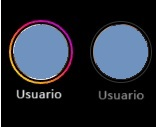
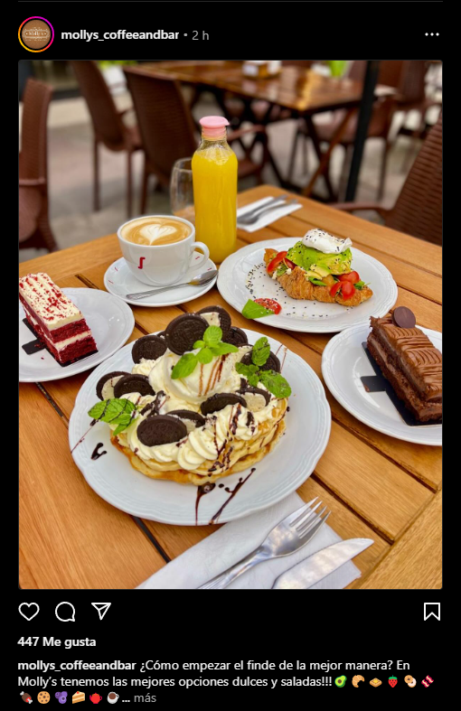
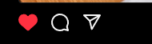

# Clon de Instagram

Consigna:
Vamos a crear un clon de Instagram que contenga los siguientes componentes:

- Un componete Wrapper de toda la app que muestre el feed y las historias si el usuario está logueado, o un formulario de inicio de sesión / registro si no lo está (O un enlace que dirija al login y si les queda tiempo, sí arman el formulario).

- Un componente Historia que se muestre con el borde de color si no fue vista o opacada si ya se vio

- Un componente Post que incluya lo siguiente:

  
  -- La imagen del posteo

  
  -- Un texto con la descripción del post

  
  -- La cantidad de likes que recibió el posteo. Si no tiene liks, no debe mostrarse. Si la prop de likes tiene un número de likes, debe mostrarse.

  
  -- Un componente Like que muestre un ícono de un corazón contorneado en color neutro si la historia no fue likeada o un corazón rojo si recibió un like
  

Por ahora, todas las funcionalidades dinámicas las manejaremos mediante props y cambiaremos los valores manualmente (ejemplo: La diferencia entre el posteo likeado y el que no, es que el componente like tiene una prop liked="true" por ejemplo).

¡A codear!
